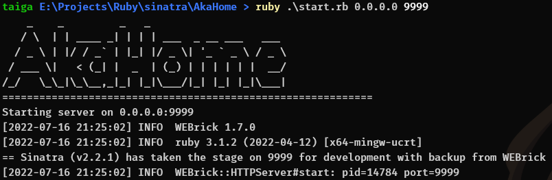
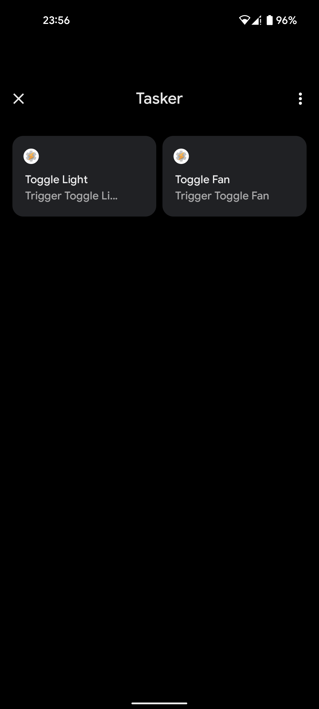

# AkaHome

<!-- # Short Description -->

Home automation and health tracking.

<!-- # Badges -->

[](https://github.com/Avellea/AkaHome/issues)
[](https://github.com/Avellea/AkaHome/network/members)
[](https://github.com/Avellea/AkaHome/stargazers)
[](https://github.com/Avellea/AkaHome/)

# Tags

`ruby` `sinatra` `health` `home` `automation` `raspberry pi`

# Demo




# Advantages

- 100% FOSS
- Easily implemented with any Raspberry Pi

# Installation

```
$ git clone https://github.com/Avellea/AkaHome.git && cd AkaHome
$ gem install bundler
$ bundler install
```

# Deployment

```
$ sudo ruby ./start.rb <ip> <port>
```

NOTE: `sudo` is required for Raspberry Pi functions. **DO NOT OPEN THIS TO THE WORLD!**

# Minimal Example

```
$ curl -X POST -d 'light=on' http://localhost:9999/api/v1/light/set
```
That line will turn on your lights, assuming you have a servo attached to that switch.

# Contributors

- [Avellea](https://github.com/Avellea)

<!-- CREATED_BY_LEADYOU_README_GENERATOR -->
